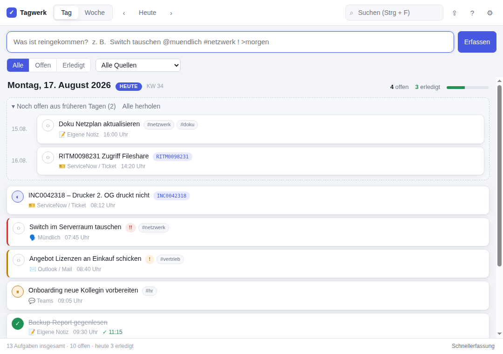
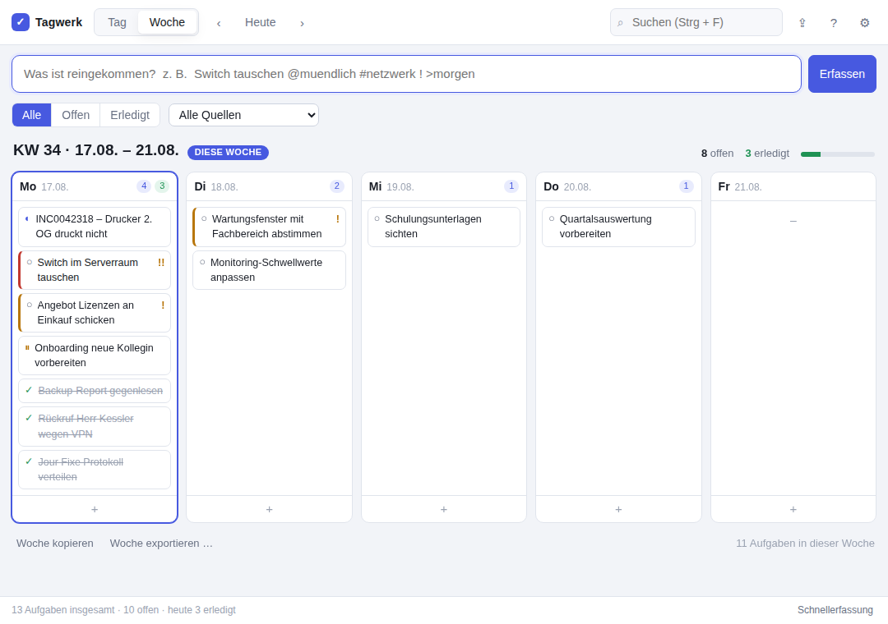

# Tagwerk

Eine kleine Electron-App, um festzuhalten, was im Laufe eines Arbeitstages so
reinkommt – aus Teams, aus Outlook, aus ServiceNow, per Telefon oder einfach als
Zuruf im Flur. Eine Zeile tippen, Enter, weiter arbeiten. Am Ende der Woche
steht da, was man gemacht hat.



## Was die App kann

- **Erfassen in einer Zeile** – Quelle, Tags, Priorität und Zieltag stehen mit
  im Text (`Switch tauschen @muendlich #netzwerk ! >morgen`), der Rest wird
  automatisch erkannt.
- **Schnellerfassung per globalem Tastenkürzel** (`Strg + Alt + T`) – ein
  kleines Fenster erscheint über allem anderen, auch wenn Tagwerk gerade im
  Hintergrund läuft. Tippen, Enter, weg.
- **Tages- und Wochenansicht** – die Woche als Spalten, Aufgaben lassen sich
  zwischen den Tagen ziehen.
- **Nichts fällt hinten runter** – offene Aufgaben aus früheren Tagen stehen
  oben in der Tagesansicht und lassen sich mit einem Klick herholen.
- **Vier Zustände**: offen → in Arbeit → wartet → erledigt, per Klick auf den
  Kreis links durchschaltbar.
- **Export** als Markdown (für den Wochenbericht oder eine Mail), CSV (Excel)
  oder JSON (Sicherung). Auch direkt in die Zwischenablage.
- **Läuft im Infobereich weiter**, wenn man das Fenster schließt.
- **Hell/Dunkel** nach Systemeinstellung oder fest gewählt.



## Starten

```bash
npm install     # einmalig, lädt Electron herunter
npm start       # App starten
npm run dev     # dasselbe mit geöffneten Entwicklertools
npm test        # Tests für Datum, Parser, Export und Persistenz
```

Getestet mit Node 22 und Electron 43.

## Bedienung

### Die Erfassungszeile

Alles kommt in eine Zeile, die Reihenfolge ist egal:

| Eingabe | Bedeutung |
| --- | --- |
| `@teams` | Quelle. Möglich: `@teams` `@mail` `@ticket` `@muendlich` `@telefon` `@meeting` `@selbst` `@sonstiges` |
| `#netzwerk` | Schlagwort, beliebig viele |
| `!` bzw. `!!` | Priorität hoch bzw. dringend |
| `>morgen` | Zieltag: `>heute` `>morgen` `>uebermorgen`, Wochentage `>mo`…`>so`, `>+3`, `>24.12.` |
| `INC0012345` | Ticketnummern (INC, RITM, REQ, CHG, PRB, SCTASK, TASK, KB) werden als Referenz erkannt und setzen die Quelle auf Ticket |

Unter dem Feld steht live, was erkannt wurde. Alles, was nicht erkannt wird,
bleibt einfach Teil des Titels – `Umsatz >1000 prüfen` wird also nicht
versehentlich verschoben.

### Tastenkürzel

| Kürzel | Wirkung |
| --- | --- |
| `Strg + Alt + T` | Schnellerfassung – wirkt systemweit (in den Einstellungen änderbar) |
| `Strg + N` | Cursor in die Erfassungszeile |
| `Strg + F` | Suchen |
| `Strg + 1` / `Strg + 2` | Tages- / Wochenansicht |
| `Strg + E` | Exportieren |
| `Strg + ,` | Einstellungen |
| `Alt + ←` / `Alt + →` | einen Tag bzw. eine Woche zurück / vor |
| `Alt + ↓` | zurück zu heute |
| `F1` | Kurzanleitung |
| `Esc` | Suche leeren, Bearbeitung abbrechen, Schnellerfassung schließen |

In der Bearbeitungsmaske speichert `Strg + Enter`.

## Wo liegen die Daten?

Alles in einer einzigen JSON-Datei im Benutzerprofil – zum Sichern reicht es,
den Ordner zu kopieren. Über *Einstellungen → Datenordner öffnen* kommt man
direkt hin.

| System | Pfad |
| --- | --- |
| Windows | `%APPDATA%\Tagwerk\tagwerk-data.json` |
| macOS | `~/Library/Application Support/Tagwerk/tagwerk-data.json` |
| Linux | `~/.config/Tagwerk/tagwerk-data.json` |

Daneben liegen `settings.json` (Einstellungen, Fensterposition) und
`tagwerk-data.json.bak` – die jeweils vorherige Fassung der Daten. Geschrieben
wird gebündelt und atomar (erst `.tmp`, dann umbenennen), ein Absturz mitten im
Speichern kostet also höchstens die letzte Sekunde.

## Aufbau des Projekts

```
src/
  main/           Main-Prozess (Node)
    main.js       Fenster, Tray, globales Tastenkürzel, App-Lebenszyklus
    store.js      Aufgaben laden/speichern (JSON, atomar, mit Backup)
    settings.js   Einstellungen und Fensterposition
    ipc.js        alle IPC-Handler an einem Ort
  preload/
    preload.js    contextBridge: die einzige Brücke zum Renderer
  renderer/       Oberfläche (klassisches HTML/CSS/JS, kein Build-Schritt)
    index.html    Hauptfenster
    quick.html    Schnellerfassung
    styles.css    komplette Oberfläche, Farben als CSS-Variablen
    js/
      util.js     DOM-Helfer, Toasts
      state.js    Zustand des Renderers + alle Aktionen
      item.js     Darstellung einer Aufgabe (ausführlich und kompakt)
      views.js    Tages- und Wochenansicht
      dialogs.js  Einstellungen, Export, Hilfe
      app.js      Kopfzeile, Erfassungszeile, Filter, Tastenkürzel
      quick.js    Logik der Schnellerfassung
  shared/         von Main *und* Renderer genutzt (UMD-Wrapper)
    dates.js      Tagesschlüssel 'YYYY-MM-DD', Wochen, Formatierung
    model.js      Quellen, Status, Prioritäten, Sortierung
    parse.js      Parser der Erfassungszeile
    export.js     Markdown / CSV
test/             Tests (node --test, ohne Electron)
scripts/
  make-icons.js   erzeugt die Icons in assets/ (reines Node, keine Abhängigkeiten)
```

### Wie es zusammenspielt

Die Daten liegen ausschließlich im Main-Prozess. Der Renderer schickt jede
Änderung per IPC dorthin; der Store meldet danach den kompletten neuen Stand an
**alle** Fenster (`data:changed`). Deshalb können Hauptfenster und
Schnellerfassung nie auseinanderlaufen, und der Renderer braucht keine eigene
Synchronisationslogik.

`contextIsolation` ist an, `nodeIntegration` aus – der Renderer sieht nur die
Funktionen aus `preload.js`. Beide Fenster haben eine strenge CSP; Texte werden
grundsätzlich über `textContent` gesetzt, nie über `innerHTML`.

### Datenmodell

```jsonc
{
  "version": 1,
  "items": [
    {
      "id": "itm_m4x1k2_a7b3c9",
      "title": "Switch im Serverraum tauschen",
      "notes": "",
      "source": "muendlich",          // teams | mail | ticket | muendlich | telefon | meeting | selbst | sonstiges
      "status": "offen",              // offen | aktiv | wartet | erledigt
      "priority": 2,                  // 0 normal, 1 hoch, 2 dringend
      "ref": null,                    // Ticketnummer o. Ä.
      "tags": ["netzwerk"],
      "day": "2026-08-17",            // lokaler Tag, nicht UTC
      "createdAt": "2026-08-17T05:45:00.000Z",
      "updatedAt": "2026-08-17T05:45:00.000Z",
      "doneAt": null
    }
  ]
}
```

Unbekannte oder unvollständige Felder werden beim Laden geradegezogen
(`normalize` in `store.js`), eine kaputte Datei fällt automatisch auf `.bak`
zurück. Für spätere Schema-Änderungen ist `migrate()` der richtige Ort.

## Selbst weiterbauen

Ein paar naheliegende Stellen:

- **Neue Quelle** (z. B. Jira, SAP): einen Eintrag in `SOURCES` in
  `src/shared/model.js` ergänzen – Filter, Editor, Parser-Aliase und Export
  ziehen automatisch nach.
- **Neuer Status**: `STATUSES` und `STATUS_CYCLE` in derselben Datei, dazu eine
  Farbregel in `styles.css` (`.item[data-status='…']`).
- **Weitere Ticket-Präfixe**: `REF_PATTERN` in `src/shared/parse.js`.
- **Anderes Exportformat**: eine Funktion in `src/shared/export.js` und ein
  Eintrag im Format-Auswahlfeld in `dialogs.js`.
- **Eigenes Icon**: die PNGs in `assets/` ersetzen (oder `scripts/make-icons.js`
  anpassen und `npm run icons` laufen lassen).

Die Renderer-Dateien sind bewusst klassische `<script>`-Dateien ohne Bundler:
Datei ändern, `Strg + R` im Fenster, fertig.

### Ideen für später

- Verknüpfung mit Outlook/ServiceNow (Aufgaben direkt aus einer Mail oder einem
  Ticket anlegen)
- Zeiterfassung pro Aufgabe
- Wiederkehrende Aufgaben
- Volltextsuche über alle Wochen mit Zeitfilter
- Statistik: Woher kommt eigentlich die meiste Arbeit?

## Paketieren

```bash
npm run pack    # entpackter Build in dist/ (zum Ausprobieren)
npm run dist    # Installer bauen
```

Konfiguriert sind Windows (NSIS-Installer + portable Exe), Linux (AppImage) und
macOS (DMG) – siehe `build` in der `package.json`. Für einen Windows-Build
sollte man auf Windows bauen.

Die portable Exe ist praktisch, wenn auf dem Arbeitsrechner keine Software
installiert werden darf: einmal bauen, Datei auf den Rechner kopieren, fertig.
Die Daten landen trotzdem im Benutzerprofil unter `%APPDATA%\Tagwerk`.

## Lizenz

MIT
